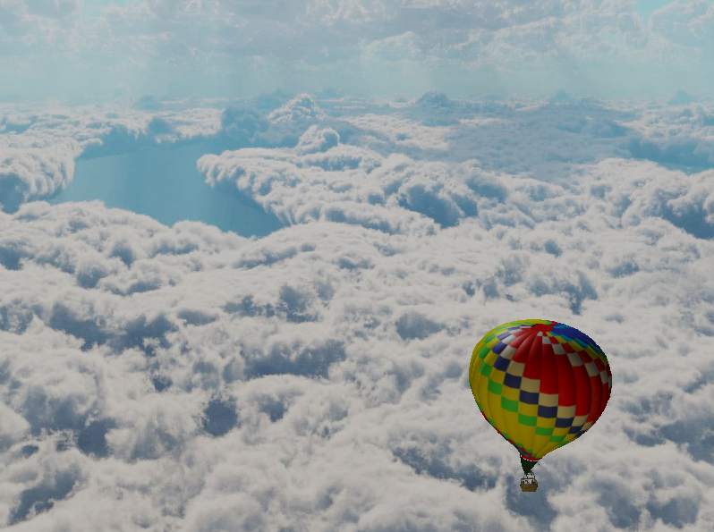
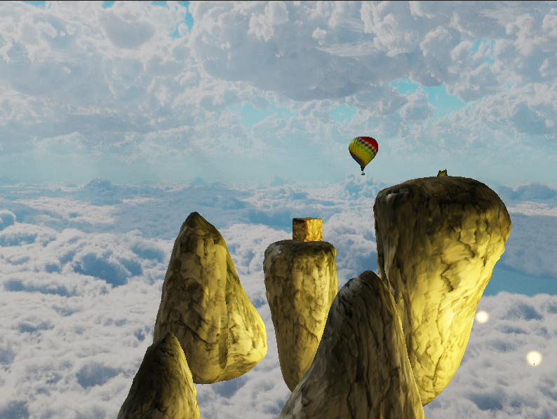

# rg-proj

Group project for Computer Graphics course.

  

## Usage
- clone repository
- open and run project in your IDE
- movement and camera: **WASD** and **mouse**
- more options: **F1**
- toggle bloom: **B**

## Features
- Cubemaps (Skybox)
- Instancing
- HDR and Bloom

## Resources
### Textures
- [Skybox](https://assetstore.unity.com/packages/2d/textures-materials/sky/skybox-series-free-103633)
- [Grass](https://www.freeiconspng.com/img/44154)
- [Gold](http://pixelbell.com/beautiful-collection-of-free-gold-textures/)
### Models
- [Air Balloon](https://www.turbosquid.com/3d-models/3d-realistic-air-balloon/1029916)
- [Small Balloon](https://www.turbosquid.com/3d-models/3d-balloon-1581182)
- [Rocks](https://www.turbosquid.com/3d-models/free-rocks-01-3d-model/810197)

## Code
Most of the code from [LearnOpenGL](https://github.com/JoeyDeVries/LearnOpenGL) by [Joey De Vries](https://joeydevries.com/#home)  
